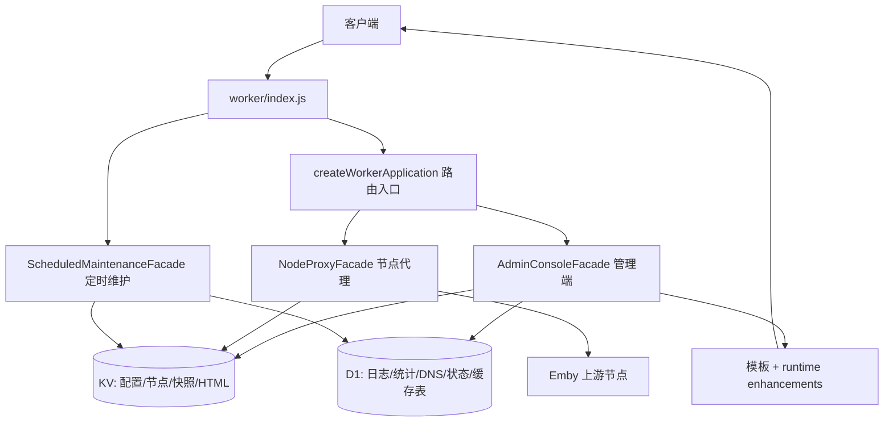

# 当前项目架构

## 1. 总体形态

项目由一个 Cloudflare Worker 和一个同源管理端组成。Worker 是边缘运行时和唯一服务端入口；管理端 HTML 可以是仓库内模板组合出来的本地版本，也可以由 Worker 从配置的远端/已上传版本投递。两者通过管理动作 API 通信。



## 2. Worker 源码分层

### 入口与组合

- `worker/index.js` 只调用 `createWorkerApplication()` 并默认导出 `workerHandler`。
- `worker/runtime/application-facades.js` 是当前组合模块。它使用 `//#region` 保留按功能域组织的实现，并在末尾组装 `AdminConsoleFacade`、`NodeProxyFacade`、`ScheduledMaintenanceFacade`。
- `createWorkerApplication()` 创建 kernel、缓存管理器、日志器、管理端 shell、代理 workflow 和定时维护服务，然后返回冻结的 handler。
- `scripts/check-worker-architecture.mjs` 将 `application-facades.js` 作为当前已知的 facade 例外（基线中约 26091 行），同时检查依赖方向、单入口、无动态 import、无遗留通用 operation bag。

### 可独立阅读的目录

- `worker/core/`：错误、常量、HTTP body、哈希、原语、运行时全局对象等低层能力。
- `worker/runtime/proxy/http/`：HTTP MIME 类型、API MIME 守卫、代理错误响应。
- `worker/runtime/proxy/playback/`：PlaybackInfo 合约、重写和有界缓存。
- `worker/testing/hooks.js`：仅测试支持；生产模块不能依赖它。
- `worker/runtime/application-facades.js` 内的主要功能域：`admin`、`auth`、`config`、`dns`、`maintenance`、`nodes`、`observability`、`proxy`、`storage/d1`、`storage/kv`。

修改 Worker 时，优先在对应的 `worker/` 独立模块中编辑；只有已经位于 facade region 的实现才编辑 `application-facades.js`。不要把新业务逻辑塞入 `worker/index.js`。

## 3. 请求生命周期

`createWorkerApplication()` 的 `fetch` 处理顺序如下：

1. 构建一次 route context：规范化 host、路径、admin path、segments，并读取初始化健康状态。
2. 如果启用 `EnableHostPrefixProxy` 且请求 host 是配置 host 的子域，优先进入 host-prefix 节点代理。
3. 对 `/`、`/favicon.ico`、`ADMIN_PATH`、`ADMIN_PATH/login`、管理端 vendor 路径和 POST 管理动作，交给 `AdminConsoleFacade`。
4. 其余请求交给 `NodeProxyFacade`。它按 host-prefix、兼容路径、普通 `/<node>/...` 路由解析节点，再调用 proxy workflow。
5. 代理 workflow 负责节点读取、访问策略、failover/探测、上游请求、流式响应、metadata cache、PlaybackInfo 改写和访问日志。
6. `scheduled()` 单独交给 `ScheduledMaintenanceFacade`，处理 KV/D1 整理、日志/统计维护和定时报告。

节点代理需要特别注意播放关键路径：PlaybackInfo、manifest、segment、视频下载和播放会话路径会走更严格的 body 上限、缓存分区、重写和生命周期控制；相关代码位于 `worker/runtime/proxy/playback/` 及 facade 中的 `proxy/playback` region。

## 4. 管理端 API 与管理端 HTML

### 路由和认证

- `ADMIN_PATH` 默认 `/admin`，登录路径为 `${ADMIN_PATH}/login`；兼容 `/api/auth/login` 仅在默认 admin path 场景保留。
- `GET /` 返回 landing/warm 页面；未认证访问管理页会重定向到登录页。
- `POST ADMIN_PATH` 接收 JSON 管理动作。请求体规范化为 `{ action, ...data }`，未知 action 返回结构化错误；历史别名 `import`、`save` 指向 `saveOrImport`。
- 认证使用 Cookie/JWT，绑定优先读取 `ENI_KV`/`KV`/兼容旧名称，D1 优先读取 `DB`/`D1`/`PROXY_LOGS`。

### 管理动作分组

动作注册在 facade 的 `defineAdminActionRegistry()` 中，当前分组为：

`dashboard`、`config`、`backup`、`nodes`、`maintenance`、`dns-records`、`dns-pool`、`notifications`、`database`。

前端调用集中在 `frontend/src/lib/admin-api.js`、`frontend/src/composables/useAdminConsole.js`，生产 HTML 中的 `App.apiCall()` 也使用相同的 POST action 契约。新增或改名 action 时必须同步 Worker registry、调用方和测试。

### 管理端事实来源与组合链

当前 Vite 入口是 `frontend/index.html`，不是 `frontend/src/App.vue` 的独立挂载入口。生产 UI 的实际链路是：

```text
frontend/admin-runtime.template.html
  + frontend/scripts/admin-runtime-enhancements.mjs
  -> frontend/scripts/sync-admin-runtime.mjs
  -> frontend/index.html
  -> frontend/dist/index.html (Vite build)
  -> Wrangler Static Assets (`ASSETS`) / Worker 管理端 shell 投递
```

部署时 Wrangler 将 `frontend/dist` 与 Worker 一起上传。已上传到 KV 或显式配置的管理端 HTML 保持最高优先级；未配置时，Worker 从 `ASSETS` 读取 `/index.html`，完成 HTML 校验和 bootstrap 注入后直接返回，因此新部署无需先手动上传前端。

`frontend/src/` 的 Vue SFC、composable 和 feature 目录仍被源码语法/行为检查覆盖，并可作为组件化实现参考；但只修改这些文件不会自动改变当前生产 HTML。涉及 UI 的改动先确认是在模板链还是 Vue 源码链上生效。

## 5. 存储边界

### KV

KV 用于运行时配置、节点实体与索引、DNS 历史、远端/本地管理端 HTML 记录，以及与缓存/整理相关的元数据。全局设置以 `sys:theme` 为唯一事实来源，保存和 settings-only 导入始终写入 KV；D1 不参与设置读写，也不会让设置进入只读状态。KV 写入通过 mutation chain、revision 和回滚逻辑保护。

### D1

D1 保存日志、统计聚合、DNS/IP 工作区数据、运行状态、缓存/锁、认证失败和 FTS 结构，不保存或投影全局设置。`initLogsDb` 是当前统一 schema 初始化动作；D1 整理必须先通过 schema readiness，再使用签名的预览 plan token 执行。

### Isolate 内存

`cacheState`/`runtimeState` 保存短生命周期缓存、single-flight、限流、日志队列、节点/PlaybackInfo/metadata 热缓存。它们不是持久化事实来源，不能作为跨请求数据存储；所有 cache 都有 TTL、数量或字节上限和清理路径。

## 6. 前端功能域

生产管理端的主要视图契约是 `dashboard`、`nodes`、`logs`、`dns`、`settings`。设置页按 UI、proxy、security、logs、account 五个保存组组织，并包含备份与恢复。Vue 源码对应 `frontend/src/features/{overview,nodes,logs,dns,settings,runtime,release}`；API 适配在 `frontend/src/lib`，偏好和主题在 `frontend/src/composables`。

## 7. 配置与外部依赖

- Cloudflare 绑定和 Cron 位于 `wrangler.toml`：KV binding `ENI_KV`、D1 binding `DB`、静态前端 binding `ASSETS`，Cron 为每小时一次。
- Worker 环境变量包括 `HOST`、可选 `LEGACY_HOST`、`ADMIN_PATH`、`JWT_SECRET`、`ADMIN_PASS` 以及兼容的绑定名称。
- 前端环境变量位于 `frontend/.env.example`，主要控制 API base、admin path、CDN base、release channel 和开发代理目标。
- 前端外部 vendor 资源由 CDN path 检查器约束；不要在生产模板中引入 inline dynamic import 或未声明的相对发布资源。
